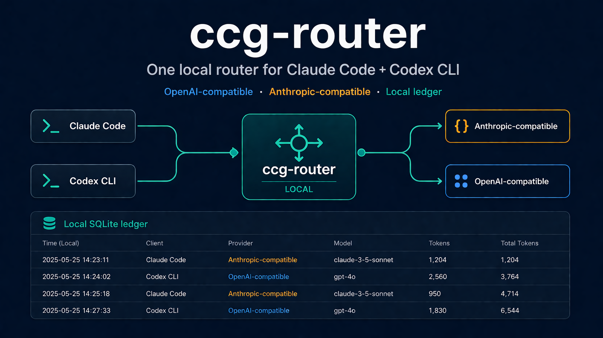

# ccg-router

[中文](README.zh-CN.md) · **English**

> One local daemon. Both Claude Code and Codex CLI talk to it.
> Anthropic-compatible **and** OpenAI-compatible on the same port — plus a local SQLite ledger for every request.




## What it does in 30 seconds

```bash
# 1. Install
brew install XZXY-AI/tap/ccg-router

# 2. Init + point both CLIs at the local router
ccg-router init
export ANTHROPIC_BASE_URL=http://127.0.0.1:17180
export OPENAI_BASE_URL=http://127.0.0.1:17180

# 3. Start it
ccg-router start
```

Now Claude Code and Codex CLI both flow through one daemon. Your provider keys stay in `~/.config/ccg-router/config.toml`. Every request is logged to a local SQLite ledger you can query with `sqlite3`.

## How is this different from claude-code-router?

| | `claude-code-router` | **`ccg-router`** |
|---|---|---|
| Claude Code routing | ✓ | ✓ |
| Codex CLI routing | — | ✓ |
| One daemon for both CLIs | — | ✓ |
| Local SQLite usage ledger | — | ✓ |
| Multiple routing strategies | — | `prefer-cheaper` / `prefer-capable` / `round-robin` |
| Hosted control plane | — | — (also no) |

If you only use Claude Code, [`claude-code-router`](https://github.com/musistudio/claude-code-router) is more mature for the single-CLI case. `ccg-router` exists for the dual-CLI workflow.

## Why try it today

- You bounce between Claude Code and Codex CLI and the env-var dance is annoying.
- You want a per-request local ledger so you can answer "how much did this side project actually cost me?" without a hosted dashboard.
- You want one config to switch routing strategy per workload, instead of editing your shell rc.

If none of those apply, you probably don't need this yet — star the repo and check back in a few weeks when `v0.2` lands streaming.

## Status

`v0.1` is a public preview for non-streaming requests. Streaming passthrough is planned for `v0.2`.

## What Works Today

- Claude Code router endpoint for Anthropic-compatible `/v1/messages`
- Codex CLI router endpoint for OpenAI-compatible `/v1/chat/completions`
- Local OpenAI-compatible and Anthropic-compatible proxy on one port
- Routing strategies: `prefer-cheaper`, `prefer-capable`, and `round-robin`
- Local SQLite usage ledger for request metadata
- Signed preset registry loader
- Read-only local dashboard at `/ui/`

## Not Yet

- Streaming passthrough
- Hosted preset registry
- Encrypted local ledger
- Advanced dashboard analytics

## Quickstart

Install with Homebrew, the release installer, or Go:

```bash
brew install XZXY-AI/tap/ccg-router
curl -fsSL https://raw.githubusercontent.com/XZXY-AI/ccg-router/main/scripts/install.sh | bash
go install github.com/XZXY-AI/ccg-router/cmd/ccg-router@latest
```

```bash
ccg-router init
export ANTHROPIC_BASE_URL=http://127.0.0.1:17180
export OPENAI_BASE_URL=http://127.0.0.1:17180
ccg-router start
```

Open `http://127.0.0.1:17180/ui/`.

## How it works

Claude Code sends Anthropic-compatible requests to `127.0.0.1:17180`. Codex CLI sends OpenAI-compatible requests to the same daemon. `ccg-router` normalizes the request, selects an upstream, forwards the raw body, and records a local ledger row.

## Features

- Anthropic-compatible `/v1/messages`
- OpenAI-compatible `/v1/chat/completions`
- Three routing strategies
- Local SQLite usage ledger
- Signed preset registry loader
- Read-only local UI

## Compare

| Need | Best fit |
|---|---|
| Route only Claude Code traffic | `claude-code-router` |
| Share one local routing layer across Claude Code and Codex CLI | `ccg-router` |
| Manually switch `ANTHROPIC_BASE_URL` and `OPENAI_BASE_URL` | Shell env vars |
| Keep provider keys local while using multiple compatible APIs | `ccg-router` |

## Search Terms

People usually find this project while looking for a Claude Code router, Codex CLI router, OpenAI-compatible proxy, Anthropic-compatible proxy, local LLM router, AI coding CLI router, or local Claude Code usage tracking.

## Guides

- [Claude Code router](docs/guides/claude-code-router.md)
- [Codex CLI router](docs/guides/codex-cli-router.md)
- [OpenAI-compatible proxy](docs/guides/openai-compatible-proxy.md)
- [Anthropic-compatible proxy](docs/guides/anthropic-compatible-proxy.md)
- [Local usage ledger](docs/guides/local-usage-ledger.md)
- [ccg-router vs claude-code-router](docs/guides/compare-claude-code-router.md)

## SEO Landing Pages

- [Claude Code router](https://xzxy-ai.github.io/ccg-router/claude-code-router/)
- [Codex CLI router](https://xzxy-ai.github.io/ccg-router/codex-cli-router/)
- [Route Claude Code to OpenAI-compatible APIs](https://xzxy-ai.github.io/ccg-router/claude-code-openai-compatible/)
- [Codex CLI OpenAI-compatible router](https://xzxy-ai.github.io/ccg-router/codex-cli-openai-compatible/)
- [ANTHROPIC_BASE_URL local router](https://xzxy-ai.github.io/ccg-router/anthropic-base-url/)
- [OPENAI_BASE_URL local router](https://xzxy-ai.github.io/ccg-router/openai-base-url/)
- [Claude Code usage tracking](https://xzxy-ai.github.io/ccg-router/claude-code-usage-tracking/)
- [Local LLM router for AI coding CLI tools](https://xzxy-ai.github.io/ccg-router/local-llm-router/)

## Tutorials

- [Use one local router for Claude Code and Codex CLI](https://xzxy-ai.github.io/ccg-router/tutorials/one-local-router/)
- [Run an OpenAI-compatible and Anthropic-compatible local proxy](https://xzxy-ai.github.io/ccg-router/tutorials/openai-anthropic-compatible-proxy/)
- [Track Claude Code and Codex CLI usage locally](https://xzxy-ai.github.io/ccg-router/tutorials/local-usage-ledger/)

## Troubleshooting

- [ANTHROPIC_BASE_URL not working with Claude Code](docs/errors/anthropic-base-url-not-working.md)
- [OPENAI_BASE_URL not working with Codex CLI](docs/errors/openai-base-url-not-working.md)
- [Homebrew install problem](docs/errors/homebrew-install.md)
- [go install ccg-router@latest problem](docs/errors/go-install-latest.md)
- [ccg-router doctor failed](docs/errors/doctor-failed.md)

## Configuration

See `docs/configuration.md`.

## Routing strategies

See `docs/routing-strategies.md`.

## Preset registry

See `docs/preset-registry.md`.

## Roadmap

- v0.1: local daemon, routing, ledger, registry verification, UI
- v0.2: streaming passthrough, richer local dashboard, more CLI adapters
- Later: encrypted ledger, plugin hooks, deeper usage analytics

## FAQ

See `docs/faq.md`.

## Community

Star the repo: https://github.com/XZXY-AI/ccg-router
Discussions:  https://github.com/XZXY-AI/ccg-router/discussions
Hub:          https://github.com/XZXY-AI/awesome-ai-coding-cli

## Contributing

Run `make test` before opening a PR. Keep public docs focused on local routing, official direct upstream examples, privacy, and reproducible behavior.

## License

Apache-2.0
