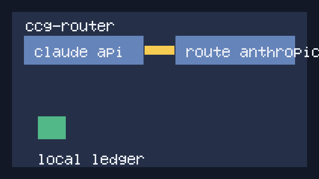

# ccg-router

[English](README.md) · **中文**

> Claude Code 和 Codex CLI 的统一本地路由器。
> 一套配置、智能 fallback、真实本地用量洞察。




## Why ccg-router?

| 工具 | 做什么 | 差异 |
|---|---|---|
| `claude-code-router` | 路由 Claude Code 流量 | 只聚焦单个 CLI |
| 手动切换 | 手动改 shell 环境变量 | 慢、不一致、没有 ledger |
| `ccg-router` | Claude Code 和 Codex CLI 的本地路由层 | 一套配置、共享路由、本地用量 ledger |

## Quickstart

```bash
ccg-router init
export ANTHROPIC_BASE_URL=http://127.0.0.1:17180
export OPENAI_BASE_URL=http://127.0.0.1:17180
ccg-router start
```

打开 `http://127.0.0.1:17180/ui/`。

## How it works

Claude Code 把 Anthropic-compatible 请求发到 `127.0.0.1:17180`。Codex CLI 把 OpenAI-compatible 请求发到同一个 daemon。`ccg-router` 会归一化请求、选择 upstream、转发原始 body，并写入本地 ledger。

## Features

- Anthropic-compatible `/v1/messages`
- OpenAI-compatible `/v1/chat/completions`
- 三种路由策略
- 本地 SQLite usage ledger
- 签名 preset registry 加载器
- 只读本地 UI

## Configuration

见 `docs/configuration.md`。

## Routing strategies

见 `docs/routing-strategies.md`。

## Preset registry

见 `docs/preset-registry.md`。

## Roadmap

- v0.1: 本地 daemon、路由、ledger、registry 校验、UI
- v0.2: streaming passthrough、model map dispatch、更多 CLI adapter
- Later: 加密 ledger、plugin hooks、更深入的用量分析

## FAQ

见 `docs/faq.md`。

## Community

See the hub:   https://github.com/XZXY-AI/awesome-ai-coding-cli
Discussions:   https://github.com/XZXY-AI/ccg-router/discussions

## Contributing

提交 PR 前请运行 `make test`。公开文档聚焦本地路由、官方直连 upstream 示例、隐私和可复现行为。

## License

Apache-2.0
